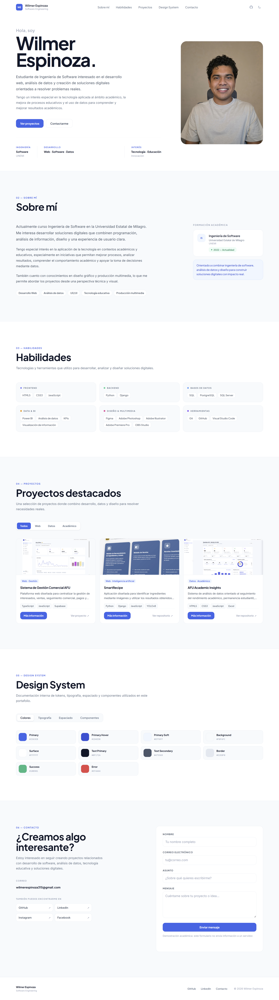

# Portafolio Personal

Portafolio web personal desarrollado como proyecto académico. Presenta mi perfil, habilidades y proyectos relacionados con desarrollo web, análisis de datos y tecnología educativa.

## Vista previa



## Proyectos destacados

- [Sistema de Gestión Comercial AFU](https://ventasafu.vercel.app/) — gestión comercial y seguimiento de ventas.
- [SmartRecipe](https://github.com/Wilmer-Espinoza/RECETAI) — reconocimiento de ingredientes y recomendación de recetas.
- [AFU Academic Insights](https://github.com/Wilmer-Espinoza/AFU-Academic-Insights) — visualización y análisis de datos académicos.

## Tecnologías

- HTML5
- CSS3
- JavaScript Vanilla

El sitio no utiliza frameworks, npm ni herramientas de compilación.

## Funcionalidades

- Diseño responsive para escritorio, tablet y móvil.
- Menú móvil y navegación interna con scroll suave.
- Tema claro y oscuro con persistencia mediante `localStorage`.
- Filtros por categoría y modales de proyectos.
- Design System con colores, tipografía, espaciado y componentes reutilizables.
- Formulario de contacto con validación y simulación de envío.

## Ejecutarlo localmente

1. Abre esta carpeta en Visual Studio Code.
2. Haz clic derecho sobre `index.html`.
3. Selecciona **Open with Live Server**.

También puedes abrir `index.html` directamente en el navegador. No requiere instalar dependencias.

## Estructura

```text
Portfolio/
├── index.html
├── css/
│   └── styles.css
├── js/
│   └── script.js
└── assets/
    ├── images/
    └── icons/
```

## Contacto

- GitHub: [Wilmer-Espinoza](https://github.com/Wilmer-Espinoza)
- LinkedIn: [wilmer-espinoza](https://www.linkedin.com/in/wilmer-espinoza/)
- Correo: [wilmerespinoza315@gmail.com](mailto:wilmerespinoza315@gmail.com)

Proyecto académico · Universidad Estatal de Milagro — UNEMI
